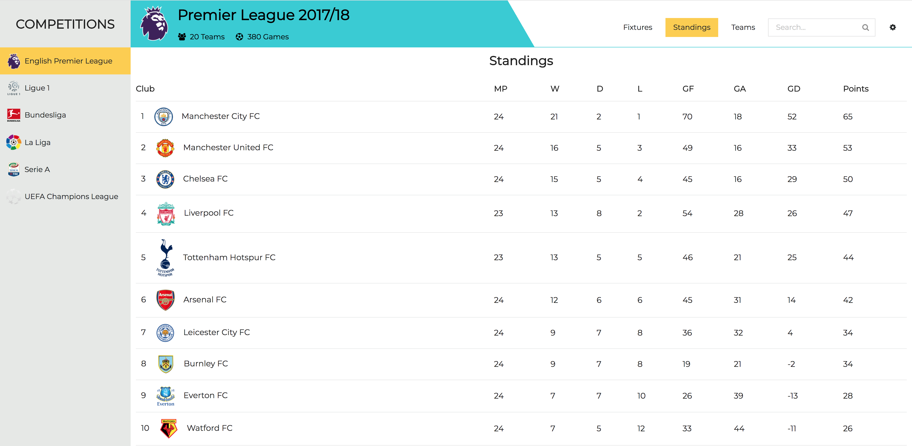
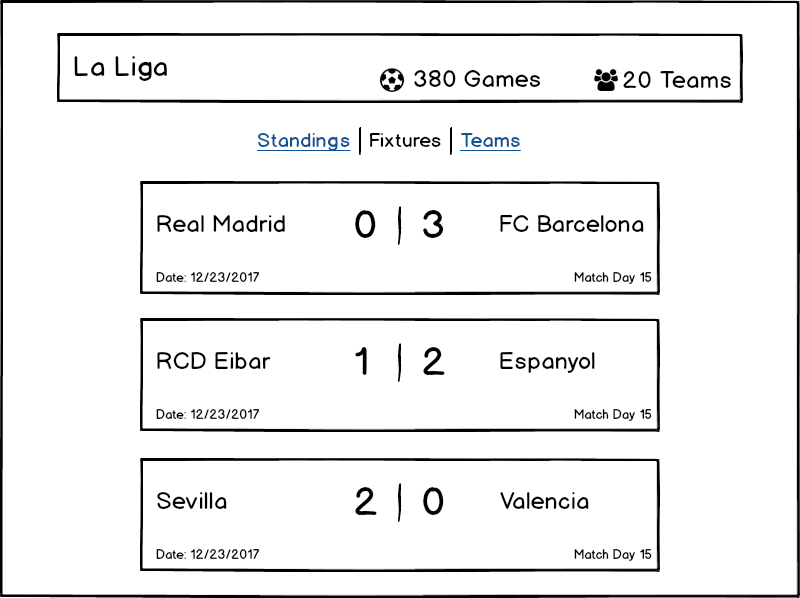

# Football Explorer ⚽️

An app that allows you to look at past and present data of major soccer leagues around the world

## Screenshot

## Application Architecture

## UI
* Home Page:
  * Show schedules for future matches from various leagues
  * Shows news(?)
* Home Page (input: year, defaults to current year if not provided)
  * Competition

* Competitions (a.k.a Leagues)
  * Fixtures
  * Teams
  * League Table (a.k.a Standings)
  

## Assets
* Team and league logos are scraped from Wikipedia using `artifacts/scripts/logos_scraper.rb`
* Country flags (for showing league country and for inter-country competitions) are scraped from Wikipedia using `artifacts/scripts/flags_scraper.rb`
* Background are images from Unsplash
* Icon fonts are from Font Awesome

## Collections
Collections should be searchable and filterable. Each collection has its own
redux store item, example, `state.fixtures`.

The filtering and searching feature is a todo.

Collections
  * competition
  * competitions
  * fixtures
  * players
  * seasons
  * standings
  * teams

## Attribution
API: https://www.football-data.org

Favicon: Soccer by Stock Image Folio from the Noun Project

Design Inspiration: https://github.com/navix/ng2-football-api
